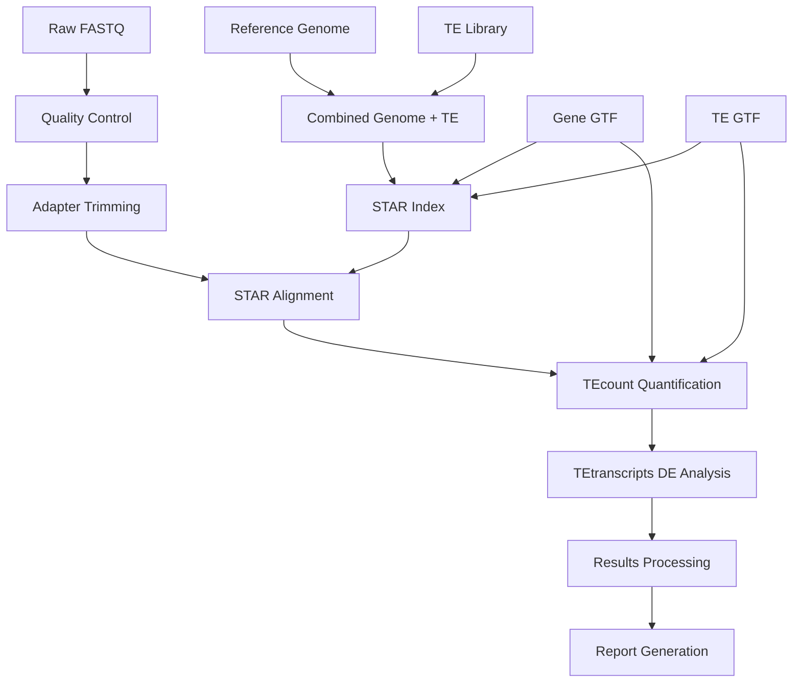

# Drosophila TE Analysis Pipeline with TEToolkit

A comprehensive pipeline for analyzing transposable element (TE) expression in *Drosophila melanogaster* RNA-seq data using TEToolkit and Casey Bergman's TE library.

## 🔬 Overview

This pipeline provides an integrated approach for quantifying both gene and transposable element expression from RNA-seq data. It uses TEToolkit's specialized algorithms to handle the challenges of mapping reads to repetitive genomic regions.

### Key Features

- **Integrated Analysis**: Simultaneous quantification of genes and TEs
- **Multi-mapping Handling**: Sophisticated approaches for repetitive element reads  
- **Quality Control**: Comprehensive QC at every step
- **Flexible Design**: Support for complex experimental designs
- **Reproducible**: SLURM-compatible with detailed logging
- **Reference Ready**: Uses established DM6 + Bergman TE library

## 🚀 Quick Start

```bash
# Clone the repository
git clone https://github.com/yourusername/drosophila-te-pipeline.git
cd drosophila-te-pipeline

# Configure your samples and paths
cp config/sample_config_template.txt config/my_samples.txt
# Edit my_samples.txt with your sample information

# Run the pipeline
sbatch scripts/tetoolkit_pipeline.sh
```

## 📋 Table of Contents

- [Installation](#-installation)
- [Usage](#-usage)
- [Configuration](#-configuration)
- [Pipeline Steps](#-pipeline-steps)
- [Output Files](#-output-files)
- [Troubleshooting](#-troubleshooting)
- [Citation](#-citation)

## 🛠 Installation

### Prerequisites

**Required Software:**
- STAR (≥2.7.0)
- SAMtools (≥1.9)
- FastQC (≥0.11.0)
- Cutadapt (≥3.0)
- MultiQC (≥1.9)
- TEToolkit (≥2.0.3)
- R (≥4.0) with data.table package
- Bedtools (≥2.29.0)

**HPC Environment:**
This pipeline is designed for SLURM-based HPC systems but can be adapted for other schedulers.

### Setup

1. **Clone the repository:**
```bash
git clone https://github.com/yourusername/drosophila-te-pipeline.git
cd drosophila-te-pipeline
```

2. **Download reference files:**
```bash
# Create reference directory
mkdir -p references/dm6_bergman

# Download DM6 genome and annotations
# See docs/REFERENCE_SETUP.md for detailed instructions
```

3. **Install R dependencies:**
```bash
Rscript -e "install.packages('data.table', repos='https://cran.r-project.org')"
```

## 🎯 Usage

### Basic Usage

1. **Configure your analysis:**
```bash
# Copy and edit the configuration template
cp config/sample_config_template.txt config/my_experiment.txt
nano config/my_experiment.txt
```

2. **Edit pipeline settings:**
```bash
nano scripts/tetoolkit_pipeline.sh
# Modify the USER CONFIGURATION section
```

3. **Submit the job:**
```bash
sbatch scripts/tetoolkit_pipeline.sh
```

### Advanced Usage

For complex experimental designs, time courses, or custom comparisons, see the [User Guide](docs/USER_GUIDE.md).

## ⚙️ Configuration

### Sample Configuration

Edit the `SAMPLES` array in the pipeline script:

```bash
SAMPLES=(
    "control_rep1:control:/path/to/R1.fastq.gz:/path/to/R2.fastq.gz"
    "treated_rep1:treated:/path/to/R1.fastq.gz:/path/to/R2.fastq.gz"
    # Add more samples...
)
```

### Step Control

Control which steps to run by setting toggles:

```bash
RUN_MODULES=1        # Load modules and verify tools
RUN_VALIDATE=1       # Validate input files  
RUN_SETUP=1          # Setup project directories
RUN_REFERENCES=1     # Prepare reference files and build indices
RUN_SAMPLES=1        # Process samples (QC, trimming, alignment)
RUN_TETOOLKIT=1      # Run TEToolkit analysis
RUN_RESULTS=1        # Process TEToolkit results
RUN_REPORTS=1        # Generate final reports
```

## 🔄 Pipeline Steps

### 1. **Quality Control & Preprocessing**
- FastQC analysis of raw reads
- Adapter trimming with Cutadapt
- Read quality filtering

### 2. **Reference Preparation** 
- Combine genome + TE library sequences
- Build STAR index for combined reference
- Prepare TE annotations (GTF format)

### 3. **Alignment**
- STAR alignment optimized for TE analysis
- Multi-mapping read handling
- BAM file processing and sorting

### 4. **TEToolkit Analysis**
- **TEcount**: Quantify genes and TEs simultaneously
- **TEtranscripts**: Differential expression analysis
- Multiple strand-specificity modes

### 5. **Results Processing**
- Organize count matrices
- Generate summary statistics
- Create analysis reports

## 📊 Output Files

```
results/
├── qc/
│   ├── multiqc_report.html          # Comprehensive QC report
│   ├── *_fastqc.html                # Per-sample FastQC reports
│   └── *_flagstat.txt               # Alignment statistics
├── tetoolkit/
│   ├── gene_te_counts_unstranded.txt    # Combined count matrix
│   ├── gene_te_counts_sense.txt         # Sense strand counts
│   ├── gene_te_counts_antisense.txt     # Antisense strand counts
│   ├── sample_info.txt                  # Sample metadata
│   └── *_vs_*_DESeq2_*                 # Differential expression results
├── differential_expression/
│   └── [Custom analysis results]
└── ANALYSIS_SUMMARY.md             # Complete analysis summary
```

### Key Output Files

| File | Description |
|------|-------------|
| `gene_te_counts_*.txt` | Count matrices for genes and TEs |
| `multiqc_report.html` | Comprehensive quality control report |
| `*_DESeq2_*` | Differential expression analysis results |
| `ANALYSIS_SUMMARY.md` | Complete pipeline summary |

## 🐛 Troubleshooting

### Common Issues

**TEToolkit not found:**
```bash
# Check module loading
module list
module load TEToolkit/2.0.3
```

**Memory issues:**
```bash
# Increase memory allocation in SLURM header
#SBATCH --mem=256G
```

**Reference file errors:**
- Ensure chromosome naming consistency between genome FASTA and GTF files
- Check file paths in configuration section

### Error Recovery

The pipeline supports step-by-step execution. If a step fails:

1. Fix the issue
2. Set only the failed step toggle to 1
3. Set all previous steps to 0
4. Rerun the pipeline

See [Troubleshooting Guide](docs/TROUBLESHOOTING.md) for detailed solutions.

## 📚 Documentation

- [User Guide](USER_GUIDE.md) - Comprehensive usage instructions
- [Reference Setup](docs/REFERENCE_SETUP.md) - How to prepare reference files
- [Output Guide](docs/OUTPUT_GUIDE.md) - Understanding your results
- [Troubleshooting](docs/TROUBLESHOOTING.md) - Common issues and solutions
- [Advanced Usage](docs/ADVANCED_USAGE.md) - Complex experimental designs

## 🏗 Pipeline Architecture



## 📈 Performance

**Typical Runtime** (16 cores, 128GB RAM):
- 2 samples: ~4-6 hours
- 10 samples: ~8-12 hours  
- 20+ samples: ~12-24 hours

**Resource Requirements:**
- CPU: 16+ cores recommended
- Memory: 128GB+ for STAR index building
- Storage: ~50GB per sample for intermediate files

## 🔬 Scientific Background

This pipeline implements best practices for TE analysis:

1. **Combined Reference**: Aligns to genome + TE consensus sequences
2. **Specialized Quantification**: TEToolkit handles multi-mapping reads appropriately
3. **Statistical Analysis**: Built-in differential expression with proper TE considerations
4. **Quality Control**: Comprehensive monitoring of all analysis steps

## 📄 Citation

If you use this pipeline, please cite:

1. **TEToolkit**: Jin et al. (2015) TEtranscripts: a package for including transposable elements in differential expression analysis of RNA-seq datasets. *Bioinformatics* 31(22): 3593-3599.

2. **Bergman TE Library**: Bergman Lab Drosophila TE sequences

3. **STAR**: Dobin et al. (2013) STAR: ultrafast universal RNA-seq aligner. *Bioinformatics* 29(1): 15-21.

## 🤝 Contributing

We welcome contributions! Please see [CONTRIBUTING.md](CONTRIBUTING.md) for guidelines.

## 📝 License

This project is licensed under the MIT License - see [LICENSE](LICENSE) for details.

## 🏷️ Version History

- **v1.0.0** - Initial release with basic TEToolkit integration
- **v1.1.0** - Added multi-strand analysis and improved error handling
- **v1.2.0** - Enhanced differential expression comparisons

---

**Keywords**: Drosophila, transposable elements, RNA-seq, TEToolkit, bioinformatics, genomics
